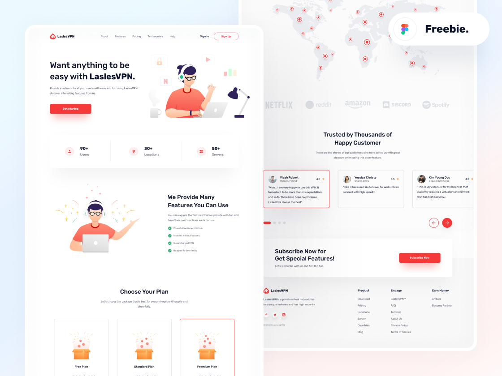

# CollaboraDesign: Transforming Interfaces with Figma
## Overview

This project showcases the use of Figma, a collaborative interface design tool, to create and refine user interfaces for diverse digital projects. Leveraging Figma's real-time collaboration features and extensive design capabilities, this effort aimed to streamline the design process, foster teamwork, and deliver visually appealing and functional interfaces.

### [Live Site](https://main--laslesvpn-mansy.netlify.app/)
### [Design On Figma](https://www.figma.com/file/y4g7B9BSJsuPkI101iyF5E/FREEBIES-Landingpage-LaslesVPN-Community)
### 

## Features and Highlights

- **Real-Time Collaboration:** Figma's collaborative platform facilitated simultaneous work, enabling team members to provide instant feedback and updates.
  
- **Design Consistency:** Utilized Figma's design system capabilities and UI component library to ensure consistency across various screens and pages.

- **Interactive Prototypes:** Created interactive prototypes to visualize and test interface functionalities.

- **Header and Navigation Bar:** A visually appealing and functional navigation bar that adapts to different screen sizes.

- **Hero Section:** An engaging hero section with a call-to-action, capturing the attention of visitors.

- **Services Section:** A section dedicated to showcasing the services offered, complete with eye-catching icons and descriptions.

- **Testimonials Section:** Highlighting positive customer experiences through testimonials, complete with client names, locations, and ratings.

- **Footer:** A comprehensive footer with navigation links, contact information, and social media links.
## Skills

### 1. HTML 
### 2. CSS 
### 3. JavaScript
### 4. Responsive Design:

- Implementing responsive layouts using media queries.
- Mobile-first design approach for optimal performance.
- Fluid grids and flexible images for adaptability across devices.
- Responsive typography for readability on various screen sizes.

## Getting Started

To get started with [Landing Page LaslesVPN], follow these steps:

1. Clone the repository to your local machine.
2. Open the `index.html` file in a web browser to view the website.
3. Customize the content and styling based on your specific needs.

## Usage

The website is designed to be straightforward to use. Navigate through the sections using the provided links in the navigation bar. Each section is crafted to provide a seamless and engaging experience for visitors.

## Customization

Feel free to customize the website to suit your preferences:

- Update text content in the HTML files.
- Modify styles in the CSS files to match your branding.
- Replace placeholder images with your own visuals.

## Responsive Design

The website is responsive and will adapt to various screen sizes, ensuring a consistent and enjoyable experience for users on desktops, tablets, and mobile devices.

## License

This website is licensed under the [MIT License](LICENSE). Feel free to use, modify, and distribute the code in your projects.
